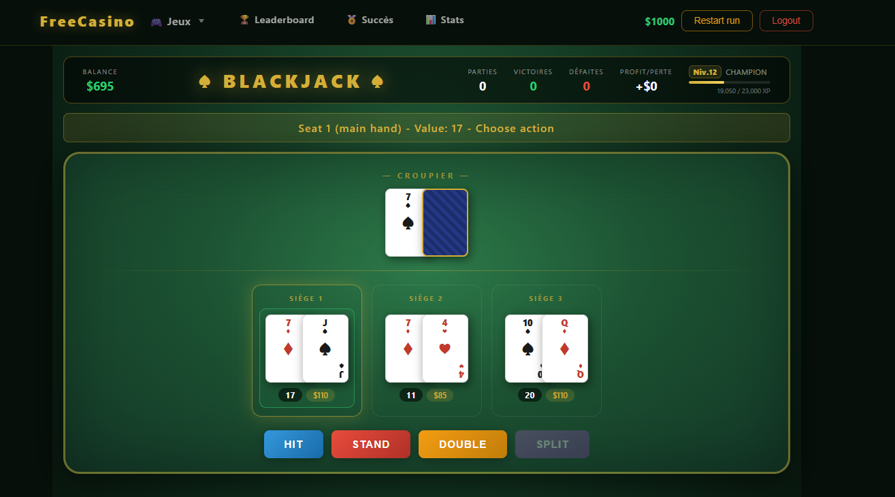
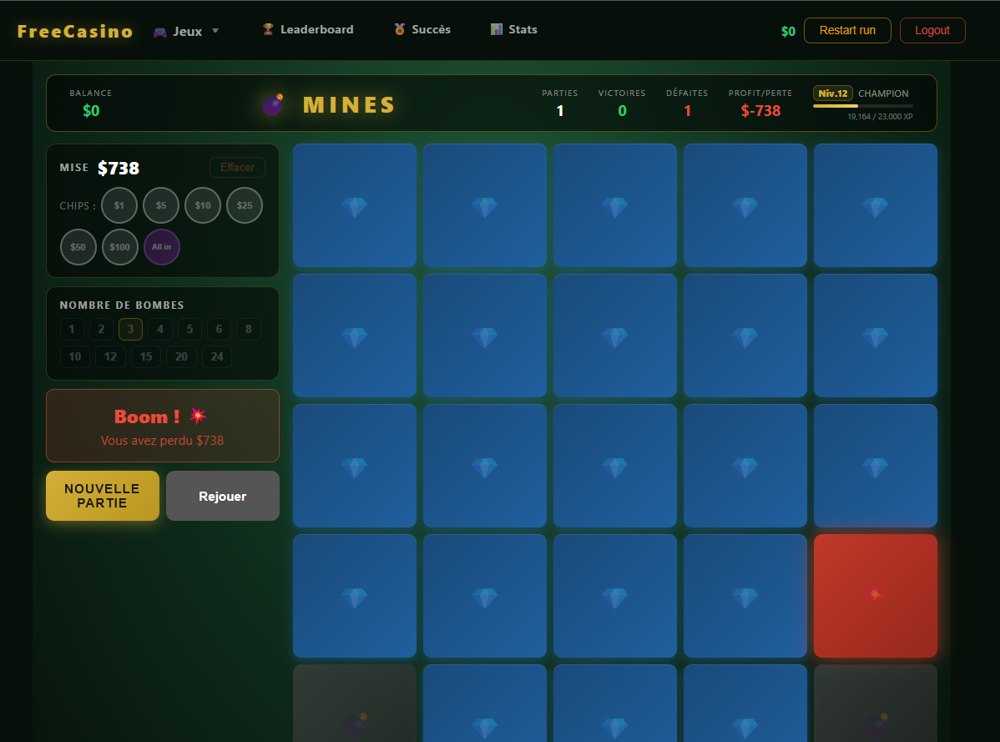
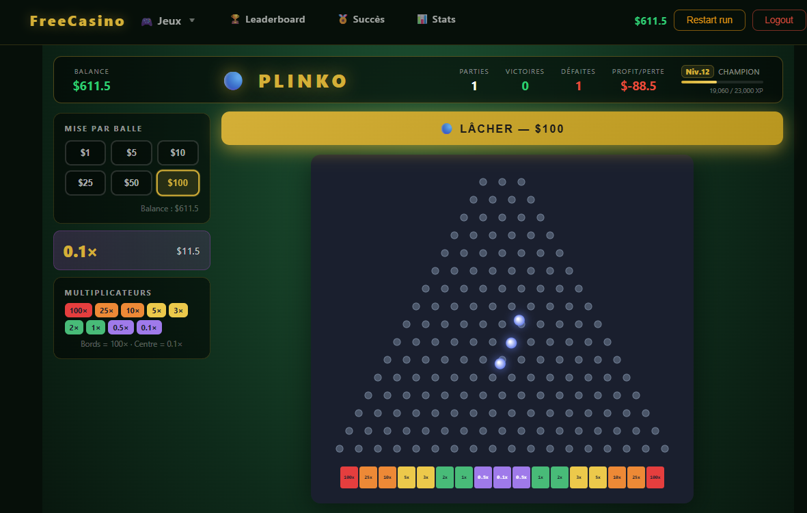
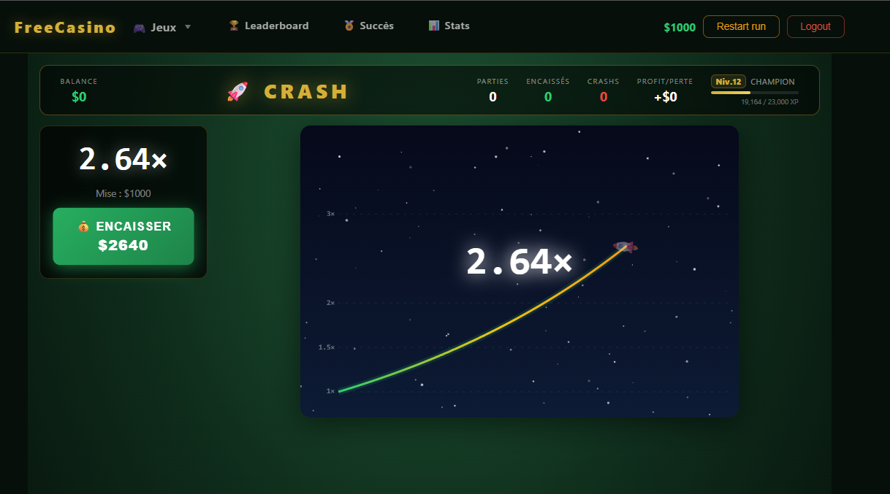
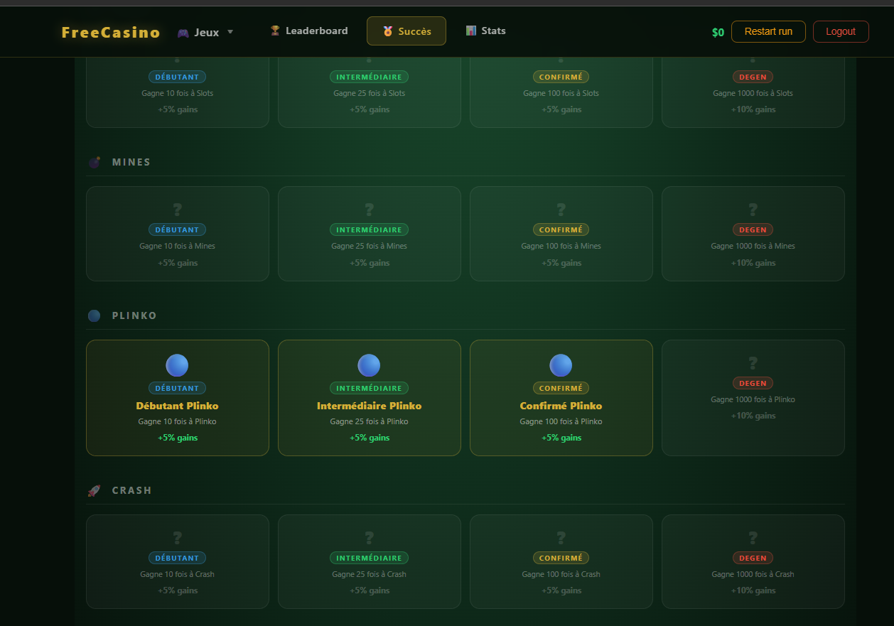
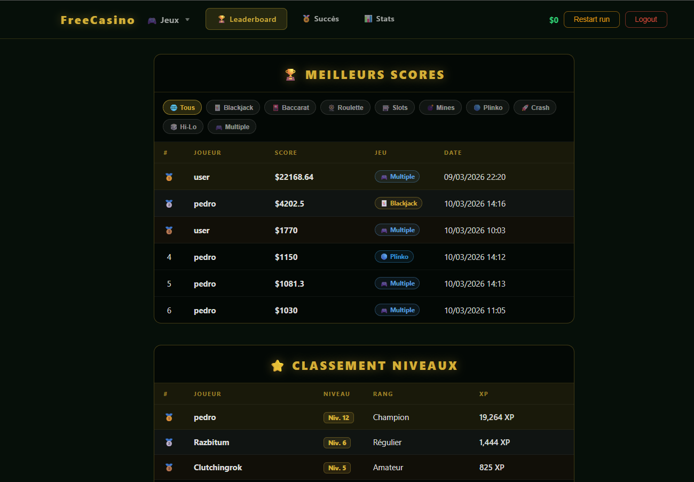

# FreeCasino

Un casino en ligne gratuit avec 8 jeux, un système de progression par niveaux, des succès à débloquer, un classement global et des statistiques de session détaillées.

---

## Jeux

| Jeu | Description |
|-----|-------------|
| **Blackjack** | Le classique — jusqu'à 6 places, split, double mise |
| **Roulette** | Roulette européenne avec tous les types de paris |
| **Baccarat** | Joueur contre Banquier avec détection des naturels |
| **Slots** | Machine à sous 3 rouleaux avec symboles pondérés |
| **Mines** | Révèle des cases sans tomber sur une mine — encaisse quand tu veux |
| **Plinko** | Lâche une balle sur un tableau de chevilles et regarde-la rebondir |
| **Crash** | Mise avant le décollage, encaisse avant que la fusée ne crashe |
| **Hi-Lo** | Prédit si la prochaine carte sera plus haute ou plus basse |

---

## Fonctionnalités

- **Progression** — gagne de l'XP après chaque partie, monte de niveau, débloque des badges de titre
- **Succès** — plus de 20 succès débloquables qui accordent des bonus permanents sur tes gains
- **Classement** — meilleurs scores classés entre tous les joueurs
- **Statistiques** — taux de victoire, profit/perte, plus gros gain, jeu favori
- **Système de run** — suis tes performances sur une session depuis un solde de départ fixe, recommence quand tu veux
- **Interface responsive** — jouable sur mobile et desktop

---

## Aperçu

<table>
  <tr>
    <td></td>
    <td></td>
    <td></td>
  </tr>
  <tr>
    <td></td>
    <td></td>
    <td></td>
  </tr>
</table>

Test d'utilisation claude code avec Sonnet 4.6 uniquement
